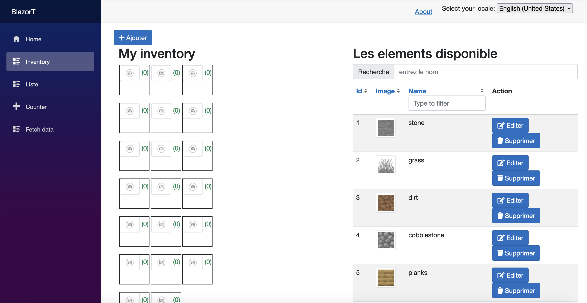
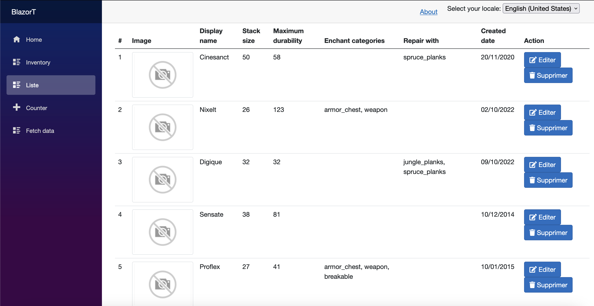

[](https://codefirst.iut.uca.fr/najlae.lambaraa/BlazorApp)  
[](https://codefirst.iut.uca.fr/sonar/dashboard?id=BlazorApp)
[](https://codefirst.iut.uca.fr/sonar/dashboard?id=BlazorApp)
[](https://codefirst.iut.uca.fr/sonar/dashboard?id=BlazorApp)
[](https://codefirst.iut.uca.fr/sonar/dashboard?id=BlazorApp)
[](https://codefirst.iut.uca.fr/sonar/dashboard?id=BlazorApp)
[](https://codefirst.iut.uca.fr/sonar/dashboard?id=BlazorApp)
[](https://codefirst.iut.uca.fr/sonar/dashboard?id=BlazorApp)
[](https://codefirst.iut.uca.fr/sonar/dashboard?id=BlazorApp)
[](https://codefirst.iut.uca.fr/sonar/dashboard?id=BlazorApp)
[](https://codefirst.iut.uca.fr/sonar/dashboard?id=BlazorApp)
[](https://codefirst.iut.uca.fr/sonar/dashboard?id=BlazorApp)


# CRAFTING APP
 
# Table de matière 
1. [Une description générale du projet](#Une-description-générale-du-projet)
2. [La liste des technologies utilisées](#technologies)
3. [Installation](#installation)
3. [Auteurs](#auteurs)

## Une description générale du projet:
***
C'est une application Minecraft réalisée avec Blazor,c'est un jeu qui consiste à placer ou en supprimant des blocs représentant différents matériaux comme de la terre, du sable, de la pierre, de l'eau, de la lave ou des minerais à partir d'une listes pour construire des structures, des outils et des armes.
### Capture d'écran:
La page consiste à placer sur l'inventory des blocs à partie de la liste des elements,et aussi :
* Supression d'un élement avec une confirmation
* Visualisation des données avec pagination
* Edition d'un élement avec validation
* Ajout d'un élement avec validation 





## Technologies:
***
La liste des technologies utilisées :
* Blazor
* C#
* HTML
* CSS
* JavaScript

## Installation:
***
1.  Cloner le projet : Tout d'abord, vous devez cloner le projet Blazor en utilisant Git.
```
$ git clone https://codefirst.iut.uca.fr/git/najlae.lambaraa/BlazorApp.git

```
2. Ouvrir le projet : Une fois que vous avez cloné le projet, ouvrez-le dans Visual Studio .
3. Démarrage API : Clique droit sur la solution,puis appuyez sur "Définir les projets de démarrage", puis sélectionnez les deux projets.
4. Exécuter le projet : Pour exécuter le projet, vous devez généralement appuyer sur le bouton "Run" ou "Debug" dans votre IDE. 
## Auteurs:
* *Augustin AFFOGNON* 
* *Najlae LAMBARAA*
